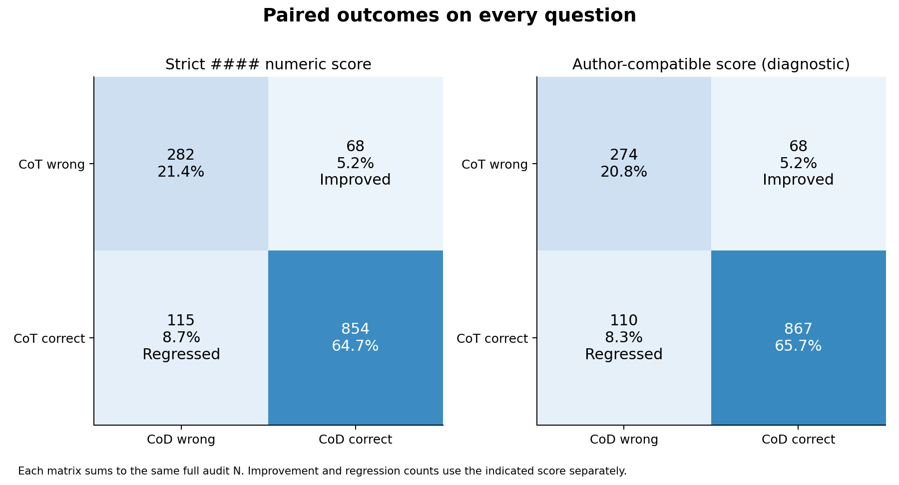
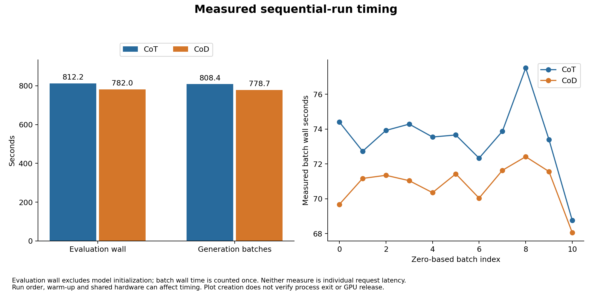

# 作者 CoT／CoD 对照的生成与执行诊断

类型：专项诊断。属于 [同一提示实验](../report.md)，不是额外训练实验。

## 同题改善与回退

<!-- visual-inspection: role=self_drawn -->

图D1：同一1319题的正确/错误转移。严格评分有68题改善、115题回退；作者兼容评分有68题改善、110题回退。每个矩阵都覆盖完整题集。 [查看 SVG 原图](../../../../../results/gsm8k-author-figures-002/02_paired_flips.svg)。

净准确率下降不意味着 CoD 每题都更差；实际同时出现改善与回退。矩阵保留两种评分，不能把宽松兼容通过叫作严格格式通过。

## 耗时到底覆盖什么

<!-- visual-inspection: role=self_drawn -->

图D2：评估函数与每批只计一次的生成墙钟，以及两组各11批的耗时。最后一批仅39题，前十批各128题。 [查看 SVG 原图](../../../../../results/gsm8k-author-figures-002/05_timing.svg)。

图中 evaluation wall 不含模型初始化；完整外层 job 时钟在报告中另列。顺序运行与预热可能影响时长，本次没有重复基准测量；把一批时间均摊给各题也不能得到真实单请求延迟。

## 首次准备失败不进入正式对照

CoT `audit-001` 在 prompt 准备时退出，耗时 19.436 秒，没有生成预测，也未进入 engine 初始化。旧检查错误地要求模板必须预填 `<think>`；真实原始 tokenizer 只预填 assistant header。修复后明确允许这个真实形式，并把评分绑定到它；不改八例、预算或采样。正式配对为 CoT002 与 CoD001。

失败的 [原始档案](../../../../../evidence/gsm8k-author-cot-audit-001/README.md) 和 [渲染核验](../../../../../evidence/cod-author-native-render-001/README.md) 保留。正常退出后的资源观察是历史事实，不代表当前服务器状态。本次不把失败启动算进两模式的1319题分母，也不把它改写成成功。
