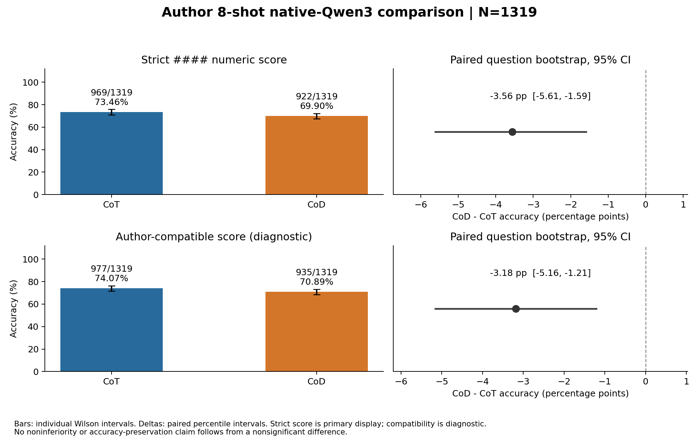
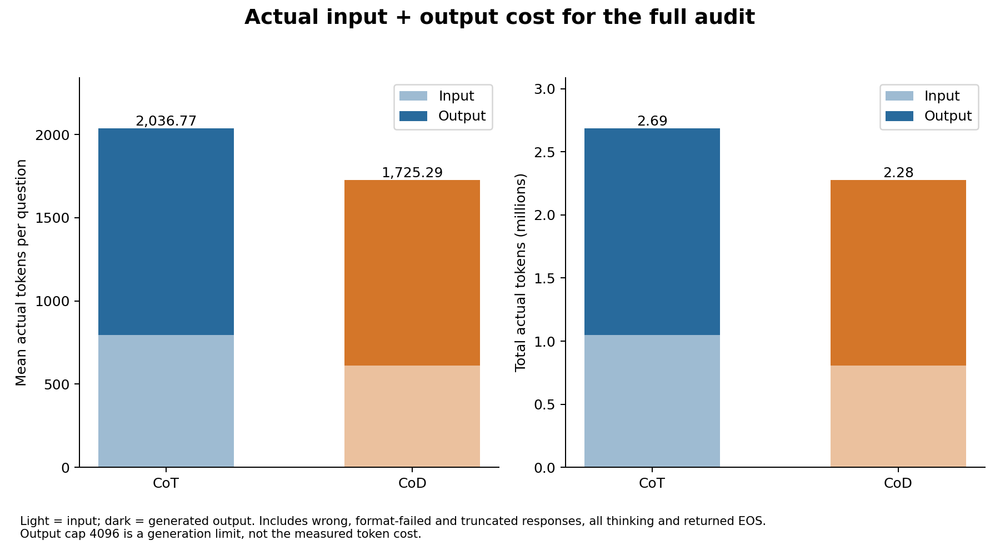
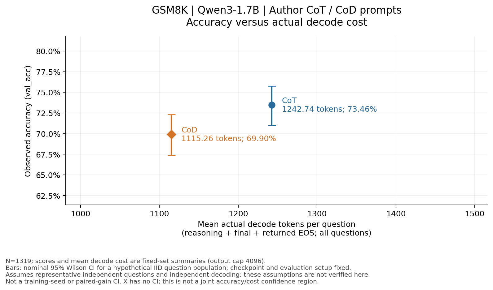
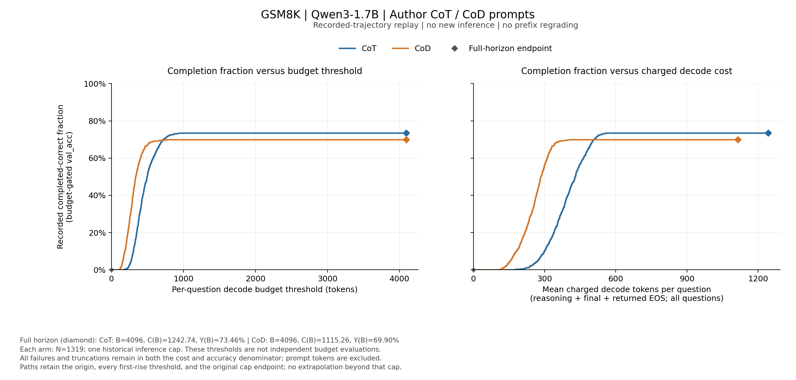
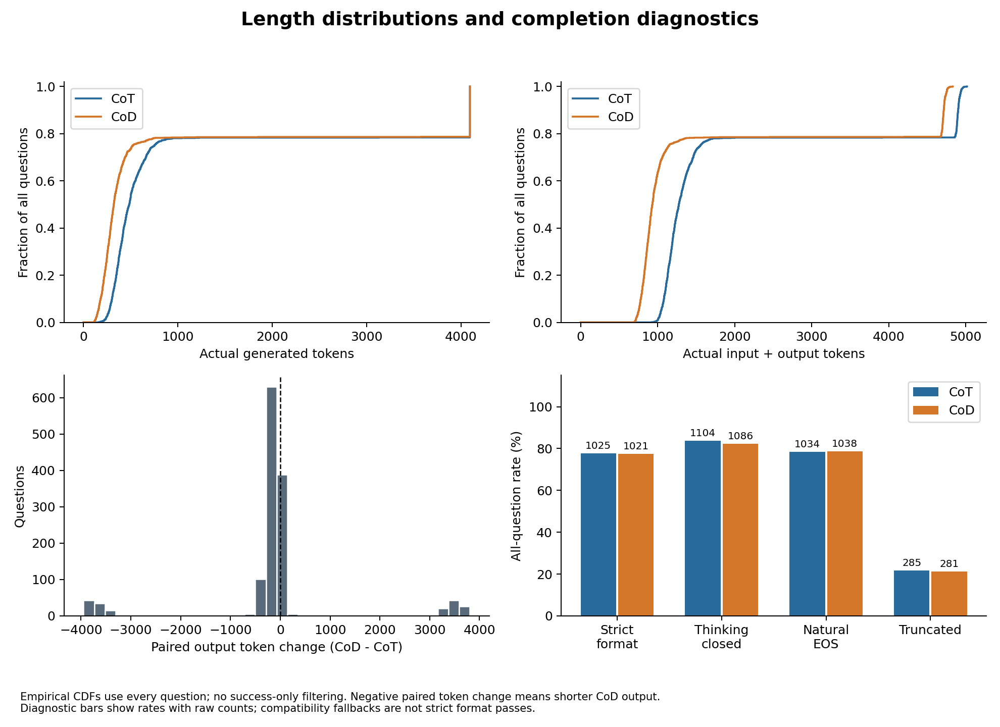

# 提示工程实验：原生 Qwen3-1.7B 在 GSM8K 上的作者八样例 CoT／CoD 对照

## 0 实验元数据

| 项目 | 内容 |
|---|---|
| 实验 ID | `gsm8k-qwen3-1.7b-author-cot-cod` |
| 实验类型 | 提示工程／纯推理对照；无 SFT、RL 或 LoRA，优化步数不适用 |
| 研究对象 | 原始 Qwen/Qwen3-1.7B，原生 thinking 开启；GSM8K 数学文字题 |
| 执行日期 | 2026-09-10，北京时间；文档重构审阅版：2026-09-13 |
| 比较范围 | 同一模型、同一 1319 题；CoT 与 CoD 各一次采样；单个 4096 输出预算 |
| 执行／证据／结论 | 完整对照完成并经历史 CPU 核验；准确率下降、token 减少 |
| run | CoT：`gsm8k-author-cot-audit-002`；CoD：`gsm8k-author-cod-audit-001` |
| 本文入口 | [设计](design.md) · [生成诊断](diagnostics/generation.md) · [复现](reproduce.md) · [机器胶囊](../../../../repro/experiments/gsm8k-qwen3-1.7b-author-cot-cod/experiment.json) |

## 1 实验概述

这次要回答：**不训练模型，只把提示中的展开推理换成简写草稿，能否让一个原生推理模型在数学题上保持准确率，同时减少 token？** 它属于 CoD 方法的提示适配研究，和 GRPO 训练是不同实验。

我们在每道测试题前放入作者提供的八道已解示例。CoT 组的示例和指令要求展开逐步推理；CoD 组则要求尽量用每步不超过五个英文词的草稿。两组使用相同示例问题和顺序、同一原始模型、同样的采样和 4096 输出上限。模型自己生成全部思考与答案，没有人为截短输出来制造节省。

严格准确率从 **73.46% 降至 69.90%**，差值 **−3.56 个百分点**，配对 95% CI 为 **[−5.61, −1.59]**；每题实际 decode 成本（含 reasoning）从 **1242.74 降至 1115.26 token**，减少 **10.26%**。若另将输入计入，总成本减少 **15.29%**。本次观察到质量与成本取舍，不支持“保持准确率的同时节省 token”。

区间的推断对象是固定模型与提示下的假想同分布题目总体，依赖 [抽样工作模型](../../../shared/evaluation.md)。这不是多次训练／解码的实测波动，也不是固定1319题这次已知计数的误差。

## 2 实验原理与方案

### CoT、CoD 与八样例分别指什么

本实验的实际 [CoT／CoD 模板](../../../../prompts/gsm8k-author-8shot/README.md) 保存在 `prompts/`，包括英文风格指令、问答格式、八例的固定来源、完整组装方法和 Qwen3 chat template。下面的自造例子只用于解释概念，不能替代实际模板。

CoT 把推理关系展开成句子；CoD 希望用简写草稿保留必要依赖，减少冗余表达。下面仅用自造例子解释区别，不是本次实际八样例或模型实测输出：

| 同一问题的表达示意 | 内容 |
|---|---|
| 题目 | 两袋各有 6 枚棋子，拿走 3 枚，还剩多少？ |
| 展开推理 | 两袋合计 2×6=12 枚；拿走 3 枚后，12−3=9 枚。 |
| 简写草稿 | `2×6=12; 12−3=9` |

“八样例”即在待测问题前展示八道已经作答的例题，让模型模仿其表达。**本次不仅改一句指令，也替换了八例的推理文本风格。** 因此 CoD 的成本变化可以来自两个部分：更短的输入示例，以及模型生成的更短输出。

原生 thinking 是模型模板的开关，不是 CoT／CoD 的同义词。两组均开启原生思考，只通过提示引导表达风格。每步五词是软提示，本次没有强制解码约束，也没有逐步验证该限制是否全部达成。

### 本次与作者原条件的关系

我们保留了作者固定版本的八例、顺序、提示拼接和兼容评分方法，但换为原生 Qwen3-1.7B，并使用 temperature=.6 等采样设置、明确切分 thinking／final。作者客户端默认 temperature=0，原模型和接口条件不同。因此这是**作者方法在另一种原生推理模型上的适配实验**，不是作者论文原条件的数值复现。

本次只有一个预算点，没有事先注册非劣界限或方法成功阈值；后续多模型、多预算实验需要另行设计。[设计与提示来源](design.md)说明完整的拼接方式及可重建来源。

## 3 实验设置与执行

| 设置 | 两组共同配置或差异 |
|---|---|
| 原始模型 | Qwen/Qwen3-1.7B；revision `70d244cc86ccca08cf5af4e1e306ecf908b1ad5e`；BF16，无 adapter |
| 任务与数据 | GSM8K 官方 test 的完整 1319 题，采用项目锁定题序；没有训练集消费 |
| 自变量 | 作者 CoT／CoD 的风格指令与八例推理文本 |
| 控制项 | 模型权重、八例题目和顺序、测试题与题序、后端、采样、上下文与输出上限 |
| 原生推理 | `enable_thinking=true`；实际模板只提供 assistant header，模型自行生成思考起止标签 |
| 采样 | 每题 n=1；temperature=.6、top-p=.95、top-k=20、min-p=0 |
| 随机种子与批次 | 起始 seed=1729，按 batch index 递增；batch=128，共 11 批，最后一批 39 题 |
| 长度限制 | 输出上限 4096；上下文 8192；完整八例和题目不得被静默裁剪 |
| 设备与后端 | 单张 L40S；vLLM 0.10.2、Torch 2.8+cu128、Transformers 4.57.1；V1 InprocClient，显存利用率 .8，非 eager |
| 代码 | 两次正式推理均来自 `61ff6a476c3cacec1fe87c846c9559a010f499dd` |

先执行 CoT，再执行 CoD，分别使用全新输出目录；没有按答案是否正确重采样。更早的 CoT `audit-001` 在准备阶段失败、没有生成答案，另行保存而未加入分母。

数据简介、典型题和外部来源见 [GSM8K 资料](../../../../datasets-and-verifiers/gsm8k/README.md)。主要评价是**严格正确率**：原生思考结构正确闭合后，final 必须有一个 `####`，后面为一个有效数值。另报告作者宽松兼容评分作诊断，不能用它代替严格格式。精确规则、边界示例和可运行代码见 [作者 verifier](../../../../datasets-and-verifiers/gsm8k/verifiers.md)，配对统计见 [共享评价口径](../../../shared/evaluation.md)。

## 4 实验结果

### 4.1 两种评分都显示 CoD 准确率下降

| 评分 | CoT | CoD | CoD−CoT | 配对 95% CI |
|---|---:|---:|---:|---:|
| 严格正确 | 969/1319，73.46% | 922/1319，69.90% | −3.56 pp | [−5.61, −1.59] pp |
| 作者兼容诊断 | 977/1319，74.07% | 935/1319，70.89% | −3.18 pp | [−5.16, −1.21] pp |

<!-- visual-inspection: role=self_drawn -->

图1：上排为严格准确率及其配对差值，下排为作者兼容诊断。两种CoD减CoT的差值区间均低于零。 [查看 SVG 原图](../../../../results/gsm8k-author-figures-002/01_accuracy.svg)。

单臂 Wilson 与配对 bootstrap 分别针对边际正确率和同题增量，二者都依赖 [题目抽样假设](../../../shared/evaluation.md)；不能用两条单臂误差条的重叠情况代替配对检验。

严格评分中，CoD 使 68 题由错变对、115 题由对变错，净少答对 47 题。区间按同题配对重采样 20,000 次、seed=20260910；它不是多 seed 生成的误差条。严格 McNemar p≈.000633，仅作未校正的描述统计；本报告不追加一个事后“成功标准”。

### 4.2 节省同时来自更短的示例和输出

| 实际成本 | CoT 总量 | CoD 总量 | CoT 每题均值 | CoD 每题均值 |
|---|---:|---:|---:|---:|
| 输入 token | 1,047,327 | 804,631 | 794.03 | 610.03 |
| 输出 token | 1,639,168 | 1,471,023 | 1242.74 | 1115.26 |
| 输入＋输出 | 2,686,495 | 2,275,654 | 2036.77 | 1725.29 |

<!-- visual-inspection: role=self_drawn -->

图2：完整1319题的实际输入和输出成本。输入加输出每题均值2036.77降至1725.29；输入示例与生成输出分别贡献节省。 [查看 SVG 原图](../../../../results/gsm8k-author-figures-002/03_actual_token_cost.svg)。

CoD 每题输入恰少 184 tokens，输出平均少 127.48 tokens。输出本身减少 **10.26%**，输入＋输出减少 **15.29%**；两个百分比不能互换。这里包含所有错误、格式失败和截断，不只看成功题。

<!-- visual-inspection: role=self_drawn -->

图3：严格准确率对平均实际 decode token 成本。CoT 为 **(1242.74, 73.46%)**，CoD 为 **(1115.26, 69.90%)**；左移代表 decode 成本降低，纵轴越高代表准确率越高。竖线为**固定模型／提示、IID 题目总体工作模型下的名义95% Wilson 区间**；独立性和代表性假设未获本实验验证。它不是多 seed、固定题集重复解码或配对增益的区间；横轴仅为样本均值。[假设与区间值](../../../shared/evaluation.md) · [SVG 原图](figures/accuracy-decode-cost/accuracy_decode_cost.svg) · [坐标、CI契约及来源](figures/accuracy-decode-cost/points.json)。

图3保留两个原预算下的实测点；它们没有相互连成预算曲线。下一张图另使用已保存轨迹的答案完成长度，给出从零开始的跃变过程。

<!-- visual-inspection: role=self_drawn -->

图4：CoT／CoD 记录轨迹的完成门控曲线。两条线从 `(0,0)` 出发，保留准确率每次首次上升的位置；同长度正确题同时计入一次跃变，原4096上限用菱形标记。右图终点为 **CoT (1242.74, 73.46%)**、**CoD (1115.26, 69.90%)**，与图3一致，最终不会像长度 CDF 那样都到100%。[SVG](figures/trajectory-jumps/trajectory_jumps.svg) · [全预算数组、跳点与来源](figures/trajectory-jumps/curves.json)。

纵轴采用原严格评分，分母始终包含全部1319题；右图消耗包括未能完成或答错的轨迹。曲线是对现有记录的回看，不是不同预算下重新生成的准确率，也不判断中途前缀是否已经出现可评分答案。计算公式及限制见 [指标与成本](../../../shared/metrics-and-cost.md)。

### 4.3 长尾、格式与终止问题仍然存在

| 诊断 | CoT | CoD |
|---|---:|---:|
| 严格格式通过 | 1025/1319，77.71% | 1021/1319，77.41% |
| thinking 完整闭合 | 1104/1319，83.70% | 1086/1319，82.34% |
| 自然 EOS | 1034/1319，78.39% | 1038/1319，78.70% |
| 达上限截断 | 285/1319，21.61% | 281/1319，21.30% |

<!-- visual-inspection: role=self_drawn -->

图5：全题输出与总token分布、配对长度变化和格式/闭合/EOS/截断。CoD中位输出更短，但两组P90/P95均到4096上限，约21%的回答仍截断。 [查看 SVG 原图](../../../../results/gsm8k-author-figures-002/04_length_and_termination.svg)。上方两幅是长度经验分布函数，纵轴为题目占比，最终达到 1；它们不是准确率曲线，质量—decode 成本应看图3、图4。

更短的中位数不表示长尾问题消失。两模式都有大量答案没有满足严格输出要求，短步提示也没有形成可被本实验确认的全面格式改善。

### 4.4 成本时钟与案例

| 时间范围 | CoT | CoD |
|---|---:|---:|
| 评估函数墙钟 | 812.23 s | 781.96 s |
| 只计一次的生成批次墙钟 | 808.40 s | 778.72 s |
| 完整 host job | 864.16 s | 833.78 s |

两个成功 job 合计约 28 分 18 秒；早先 19.44 秒的准备失败另列，不算作成功对照。此处不包含环境建设、整理或任务间等待，也没有价格数据用于计算费用。顺序运行和预热可能影响计时，不能称为普遍加速幅度。逐批时间和同题转移见 [专项诊断](diagnostics/generation.md)。

公开记录保留逐题数值与原文哈希，下列各取原题序中首个符合条件的例子，展示指标能说明的边界；完整响应因作者示例回显保留在私有归档，没有为本报告重新编造回答文本。

| 题目 ID | CoT→CoD 的实际变化 | 解读 |
|---|---|---|
| `gsm8k:test:806` | 684→453 输出 tokens；严格正确→严格格式失败；两者思考均闭合 | 更短不等于交付正确答案 |
| `gsm8k:test:740` | 4096 截断且严格失败→316 tokens、严格正确 | CoD 也有改善个例，不能只展示回退 |
| `gsm8k:test:780` | 两组都达到4096、思考未闭合、严格失败 | 本次两种提示都没有解决所有长尾问题 |

## 5 分析与讨论

本实验支持一个有限结论：在这个模型、八例提示、单次采样和 4096 预算下，CoD 节省了 token，同时损失了一部分严格准确率。它没有支持“准确率保持”，也没有说明 CoD 在所有模型或其他预算上都更差。

两组同时改变了风格指令与示例推导，因此不能把全部效果归因于某一句提示；输入成本下降也不能全部解释成模型内部推理压缩。五词规则没有逐步质量验证，未闭合与格式失败还受到原生模板及预算影响。

原始实验是一组固定预算下的配对观察；新增跃变曲线只说明这批轨迹在不同完成门槛下的表现。没有多 seed、其他模型尺寸、其他领域或非劣界限；公开数据的预训练污染也未知。后续若比较真实预算干预，应独立测量各预算，不能将此处回看曲线当作那些新测量。

## 6 结论与复现入口

**本次方法适配完成，结果为质量—成本取舍。** 下一步有价值的问题是这种取舍如何随模型、任务和预算改变，而不是直接用本单点宣称 CoD 普遍有效或无效。

- [复现指南](reproduce.md) 分开说明公开数值复算、私有全文重评分与重新生成。
- [机器胶囊](../../../../repro/experiments/gsm8k-qwen3-1.7b-author-cot-cod/experiment.json) 保存原始代码版本、配置、来源锁与命令。
- [原配对结果](../../../../results/gsm8k-author-comparison-001.json)、[图数据来源](../../../../results/gsm8k-author-figures-002/plot_manifest.json) 与 [发布边界](../../../../evidence/gsm8k-author-comparison-001/publication_boundary.md) 可供追查。

本审阅版只重构说明与引用，没有重新运行推理或修改原始实验结果。
