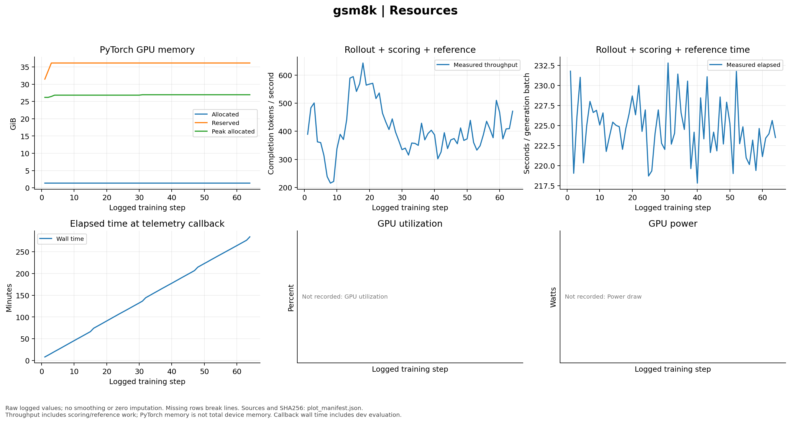
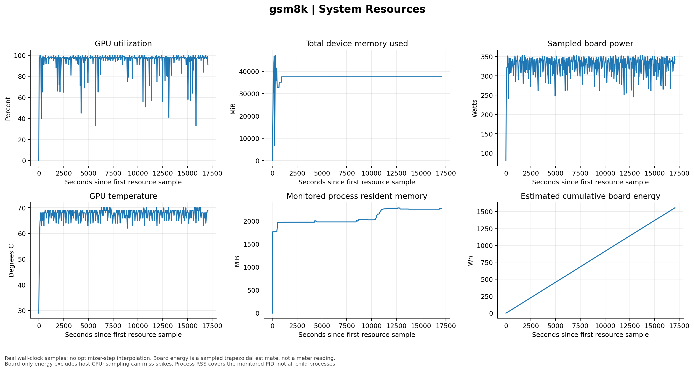

# GSM8K GRPO 的优化与资源诊断

类型：实验专项诊断。主结论见 [报告](../report.md)；这里补充资源和记录语义，不另宣布一个性能结果。

## 怎样读优化记录

训练 reward 会随采样题目波动；固定 dev 用于选择。非零 advantage 与梯度证明更新链路有信号，但必须结合完整 audit。前两步一半 LoRA 矩阵的梯度数值为零，矩阵覆盖率仍为 100%；这不等于梯度缺失。所有步骤、矩阵与原始详细记录见 [gradients](../../../../../results/gsm8k-grpo-formal-001/gradients.jsonl) 及 [完整矩阵记录](../../../../../results/gsm8k-grpo-formal-001/gradient_details.jsonl.gz)。

## 训练器视角的资源

<!-- visual-inspection: role=self_drawn -->

图D1：PyTorch allocated/reserved/peak显存、rollout加评分/参考计算吞吐及回调墙钟；它们不是整卡物理显存，也不是单请求解码速度。 [查看 SVG 原图](../../../../../results/gsm8k-grpo-formal-001/figures/04_resources.svg)。

allocated、reserved 与 peak 描述分配器的不同量，不能相加。周期 dev 会增加回调墙钟；rollout-and-reference 吞吐包含评分和参考计算，不能拿来与仅 decode token/s 直接比较。未记录的回调 GPU 利用率／功率没有填零。

## 宿主采样视角

<!-- visual-inspection: role=self_drawn -->

图D2：实际时间采样的GPU利用率、整卡显存、功率、温度和被监控PID的RSS，以及板卡功率积分。横轴是经过秒数，不是插值出来的训练步。 [查看 SVG 原图](../../../../../results/gsm8k-grpo-formal-001/figures/07_system_resources.svg)。

这些是采样点，不能保证捕获瞬时峰值；RSS 是被监控 PID 的值，不代表所有子进程总和。板卡能量不含主机 CPU，包含板卡基础功耗，也不是账单费用。数据源为 [资源 JSONL](../../../../../evidence/gsm8k-grpo-formal-001/resources.jsonl)。

另保存了同一固定 110-token dev 输入的 [训练前](../../../../../results/gsm8k-grpo-formal-001/attention-before/README.md) 和 [训练后](../../../../../results/gsm8k-grpo-formal-001/attention-after/README.md) 注意力矩阵。它们仅作定性观察，不证明某个 token 导致性能改善。
