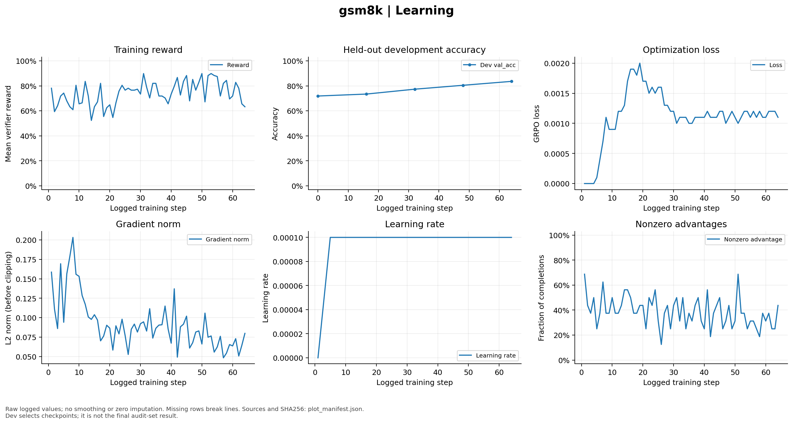
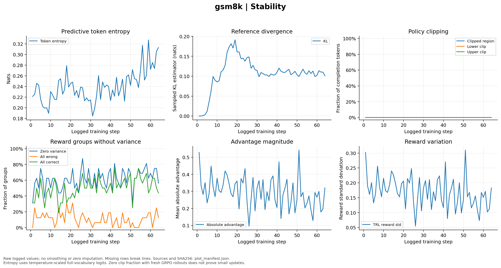
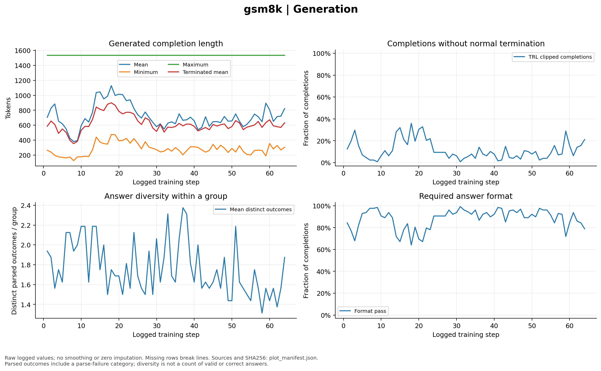
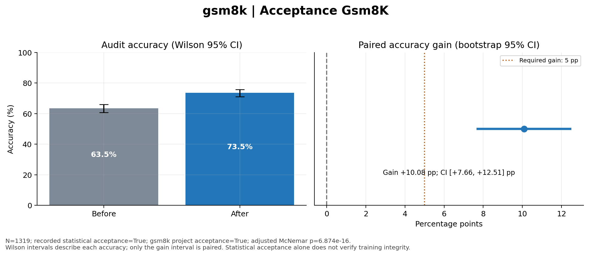
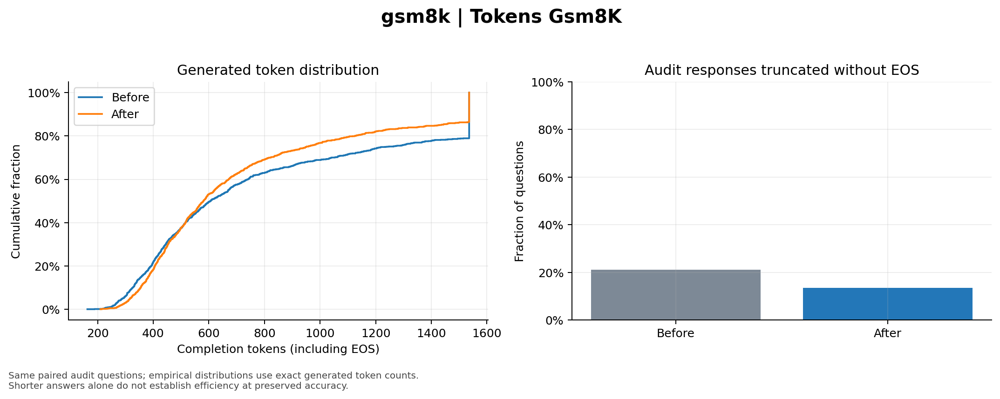
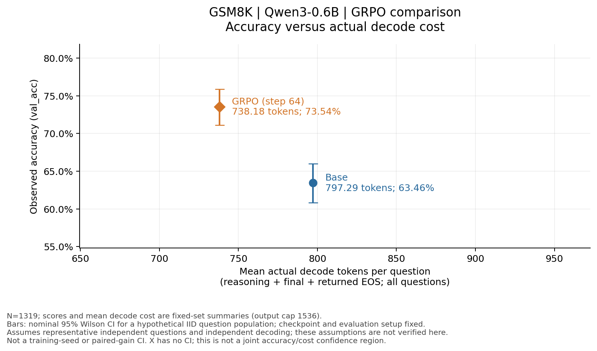
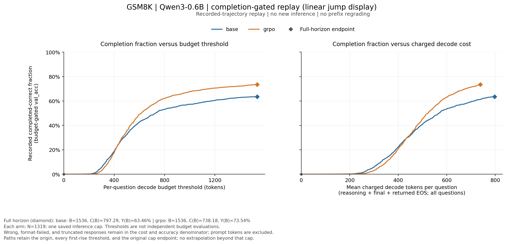

# GRPO 训练实验：Qwen3-0.6B 在 GSM8K 上的 64 步 LoRA GRPO

## 0 实验元数据

| 项目 | 内容 |
|---|---|
| 实验 ID | `gsm8k-qwen3-0.6b-grpo`；训练 run：`gsm8k-grpo-formal-001` |
| 实验类型 | RLVR／LoRA GRPO 后训练；从原始模型开始，没有本项目 SFT 冷启动 |
| 研究对象 | 原生推理模型 Qwen/Qwen3-0.6B；GSM8K 数学文字题 |
| 执行日期 | 2026-09-10，北京时间；文档重构审阅版：2026-09-13 |
| 执行与证据 | 64 步训练、两次完整 audit 已完成；历史项目验收通过 |
| 结果方向 | 正确率提高 10.083 个百分点；输出减少，但 audit 墙钟略增 |
| 本文入口 | [设计](design.md) · [专项诊断](diagnostics/optimization.md) · [复现](reproduce.md) · [机器复现胶囊](../../../../repro/experiments/gsm8k-qwen3-0.6b-grpo/experiment.json) |

## 1 实验概述

这次实验要回答：**在一张 L40S 上，仅用最终答案正确性作为奖励，64 步 GRPO 能否让一个原生推理小模型在完整数学测试集上明显提分？** 它是一个独立的数学GRPO实验。

我们从原始 Qwen3-0.6B 开始训练 LoRA 参数，每道题生成 8 个回答，用组内奖励差异学习。按固定 dev 选择 step 64 后，原始权重与该 adapter 分别回答相同的 1319 道 GSM8K 测试题。正确数从 **837 增至 970**，即 **63.457%→73.541%**；差值的配对 95% CI 为 **[7.657, 12.509] 个百分点**，满足事先规定的数学项目标准。

平均实际输出从 797.293 降至 738.180 token，但评估函数墙钟从 2254.642 增至 2353.292 秒。因此，结论是固定评价契约下的答题表现改善，不能同时宣布推理加速。

本文的区间按 [明确的题目总体抽样工作模型](../../../shared/evaluation.md) 解释：条件于本次 checkpoint 和评价设置，不代表重新训练的波动；固定1319题这次的正确计数本身是已知值。

## 2 实验原理与方案

RLVR 用能够核验的结果给奖励。这里每条回答只按**最终数值是否正确**得 1 或 0；没有人工奖励模型，没有逐步推导正确性评分，也没有额外长度奖励。

GRPO 对一道题生成 G 个回答，比较这一组的奖励高低，形成相对 advantage。若一组全对或全错，组内没有奖励差异，这组的正确性奖励不提供相对学习信号。本次同时观察零方差率的全对／全错构成，避免把“零方差”一律理解为失败。

LoRA 让原始主体权重保持冻结，只训练低秩适配参数。此次训练 20,185,088 个 LoRA 参数；最终对照为“原始模型”与“原始模型＋所选 LoRA”。两者都使用原生 thinking 和相同的评价提示、采样及输出预算。概念与指标的详细解释见 [共用概念](../../../shared/concepts.md) 和 [指标说明](../../../shared/metrics-and-cost.md)。

方案的判据预先固定：完整 audit 的增量至少 5 个百分点、配对区间下界大于 0，并通过原协议预留的二重校正统计阈值。模型选择只看 dev，不能用 audit 选择最好 checkpoint。完整设计见 [design.md](design.md)。

## 3 实验设置与执行

### 数据与对照

GSM8K 官方 train 的 7473 题划为 **6961 题训练池、512 题 dev**；每次选点实际使用固定 128 条 dev。官方 test 的 **1319 题全部用于最终 audit**。训练池规模不等于本轮消费量：64 步实际生成 1024 个题目组、8192 条回答，不是完整遍历 6961 题一轮。数据简介、典型题和外部来源见 [GSM8K 资料](../../../../datasets-and-verifiers/gsm8k/README.md)；本实验采用其中的 [GRPO verifier](../../../../datasets-and-verifiers/gsm8k/verifiers.md)。

| 对照 | 参数状态 | 测量用途 |
|---|---|---|
| 原始模型 | Qwen3-0.6B 原始权重，无 adapter | 完整 audit 基线 |
| 训练中模型 | 原始权重＋当前 LoRA | 每 16 步在固定 dev 上选点 |
| GRPO 后模型 | 原始权重＋step 64 最佳 adapter | 与原始模型做同题完整 audit |

模型 revision 为 `c1899de289a04d12100db370d81485cdf75e47ca`；数据 revision 与划分详见 [模型与数据](../../../shared/models-and-data.md)。基线 audit 在训练进程结束后独立运行，但加载的仍是原始权重。

### 训练与评价配方

实际消息模板见 [gsm8k-grpo-cot-v1](../../../../prompts/gsm8k-grpo/README.md)，包括完整 system 指令、question 变量和原生 chat template；训练前后评价使用同一模板。

| 参数 | 实际设置 |
|---|---|
| 硬件／框架 | 单张 NVIDIA L40S；Torch 2.6.0+cu124，TRL 0.24.0，Transformers 4.57.1，PEFT 0.17.1 |
| 生成后端／精度 | 原生 Transformers，未启用 vLLM；BF16，TF32 开启 |
| 更新量 | 64 步；G=8、B=16，每步 128 条回答；microbatch=4，梯度累积=32 |
| LoRA | r=32，alpha=64，dropout=0，bias=none；q/k/v/o 与 gate/up/down 投影 |
| 优化器 | AdamW，LR=1e-4，warmup=4 步后恒定；β₁=.9、β₂=.999、ε=1e-8、weight decay=0 |
| 损失／约束 | GRPO，组内 reward 归一化，μ=1，token 级 importance sampling；KL β=.01，ratio clipping ε=.2，梯度上限 1.0 |
| 生成 | 原生 thinking；输出上限 1536，temperature=.6，top-p=.95，top-k=20，repetition penalty=1 |
| 其他 | gradient checkpointing 关闭；截断 completion 不从损失中整体屏蔽 |
| 随机性 | 训练／数据 seed=20260910；dev/audit seed=1729；每模型每题一次回答 |
| 选择与 audit | dev 在 step 0/16/32/48/64；选最早最高；完整 audit batch=128 |

训练源码为 `75e05a6`，两次 audit 源码为 `9359731`。这两个阶段不能统一记成一个“当前版本”。[机器胶囊](../../../../repro/experiments/gsm8k-qwen3-0.6b-grpo/experiment.json) 分别保存代码身份、配置和原始命令。

## 4 实验结果

### 4.1 固定 dev 随训练提高，选中最后的 step 64

| step | 0 | 16 | 32 | 48 | **64** |
|---|---:|---:|---:|---:|---:|
| dev 正确数／128 | 92 | 94 | 99 | 103 | **107** |
| dev acc | 71.875% | 73.438% | 77.344% | 80.469% | **83.594%** |

<!-- visual-inspection: role=self_drawn -->

图1：64步中的训练reward、固定dev、优化损失、裁剪前梯度范数、学习率和非零advantage。只有五个dev实测点；step64是最高点。 [查看 SVG 原图](../../../../results/gsm8k-grpo-formal-001/figures/01_learning.svg)。

看中上方的固定 dev，而不是用训练 reward 曲线直接代替测试成绩。训练题和输出随步变化，reward 后段回落与固定 dev 上升可以同时出现。GRPO loss 也不是监督学习的任务错误率，不能只凭其升降判断提分。

### 4.2 熵、KL、梯度与零方差没有被平均数掩盖

<!-- visual-inspection: role=self_drawn -->

图2：预测token熵、参考KL、策略clipping、零方差组及全对/全错拆分、advantage幅度和reward变化。熵后期上升；KL早期上升后回落；clipping记录全为零。 [查看 SVG 原图](../../../../results/gsm8k-grpo-formal-001/figures/02_stability.svg)。

熵范围为 **0.1845–0.3275 nats**，首／末步为 .2213／.3131；参考 KL 最大约 .1911，末步约 .1013。零方差率步均值 **61.328%**，由 **50.391% 全对组＋10.938% 全错组**组成。因此，这次不能归纳为“熵下降导致崩溃”，也不能把零方差率全部解释为不会做题。

64 步均有非零全局梯度和非零 advantage；392 个可训练矩阵每步都有梯度张量，缺失梯度为 0。前两步仅 196 个矩阵梯度数值非零，其余数值为零；这与 `grad=None` 不同。裁剪前全局范数范围 **.0484–.2032**，没有达到 1.0 的裁剪上限。clipping 比例为零不表示参数没有更新，初末参数与所选 adapter 的变化另有核验。

### 4.3 训练输出仍有波动

<!-- visual-inspection: role=self_drawn -->

图3：训练回答长度、终止、组内不同解析结果及格式通过率。包含错误、解析失败与截断，不代表只统计成功答案。 [查看 SVG 原图](figures/03_generation.svg)。 本审阅稿仅移动图例以免遮挡曲线；[绘图记录](figures/plot_manifest.json)验证使用的数值序列与原图一致。

训练格式通过率在 **64.06%–99.22%** 间变化，截断比例约 **0.78%–35.94%**。最后一步的表现不代表整个固定测试集；下一节才是最终评价。图中的不同解析结果数包含解析失败类别，不是“有效解法数量”。

### 4.4 完整测试集改善 10.083 个百分点

| 指标 | 原始模型 | 所选 GRPO 模型 |
|---|---:|---:|
| 题数 | 1319 | 1319 |
| 正确数／准确率 | 837／63.457% | 970／73.541% |
| 最终格式通过 | 984／74.602% | 1140／86.429% |
| EOS | 1041／78.923% | 1142／86.581% |
| 无 EOS 的预算截断 | 278／21.077% | 177／13.419% |
| 平均实际输出 token | 797.293 | 738.180 |

<!-- visual-inspection: role=self_drawn -->

图4：两模型完整1319题准确率及各自Wilson区间，以及增量的配对bootstrap区间；增量10.083个百分点，配对95%区间7.657至12.509。 [查看 SVG 原图](../../../../results/gsm8k-grpo-formal-001/figures/05_acceptance_gsm8k.svg)。两类区间都依赖 [题目／题目对的抽样假设](../../../shared/evaluation.md)，不能据此声称多次训练的增益稳定。

203 题由错变对，70 题由对变错。精确 McNemar 原始 p=3.437×10⁻¹⁶，按原协议的因子2保守校正后 p=6.874×10⁻¹⁶。主结果满足预定标准；它仍是一次训练 seed 的结果，而不是多 seed 稳健性证明。

<!-- visual-inspection: role=self_drawn -->

图5：完整audit的实际生成token分布与预算截断率。平均输出减少7.414%，但两边P90/P95仍达到1536上限。 [查看 SVG 原图](../../../../results/gsm8k-grpo-formal-001/figures/06_tokens_gsm8k.svg)。

### 4.5 成本与实际案例

<!-- visual-inspection: role=self_drawn -->

图6：完整 audit 的准确率—decode 成本实测点。原始模型为 **(797.29, 63.46%)**，GRPO 后为 **(738.18, 73.54%)**；两者以全部 1319 题计成本，错误与截断题也保留。竖线为**固定 checkpoint、IID 题目总体工作模型下的名义95% Wilson 区间**；独立性和代表性假设未获本实验验证。它不是固定题集这次计数的误差，也不是多 seed 或配对增益区间；横轴仅为样本均值。[假设与区间值](../../../shared/evaluation.md) · [SVG 原图](figures/accuracy-decode-cost/accuracy_decode_cost.svg) · [坐标、CI契约及来源](figures/accuracy-decode-cost/points.json)。

两个点都在 1536 输出预算下测量。图5的长度 CDF 仅用于长度诊断，纵轴不是 val_acc。下面另按已保存轨迹的答案完成长度构造跃变图。

<!-- visual-inspection: role=self_drawn -->

图7：记录轨迹的完成门控跃变曲线。左图横轴为逐题 token 阈值，右图为全部题目的平均门控 decode 消耗；纵轴只计已完成且严格答对的题目，分母始终是1319。同长度的正确回答合并成一次跃变；图中按阈值或成本升序用普通折线连接保留的跃变点，线段只是视觉连接，不增加中间测量。菱形为原1536上限，终点分别回到图6的 **(797.29, 63.46%)** 与 **(738.18, 73.54%)**。[SVG](figures/trajectory-jumps-linear/budget_gated_val_acc.svg) · [全预算数组、跳点与来源](figures/trajectory-jumps-linear/curves.json) · [绘图记录](figures/trajectory-jumps-linear/plot_manifest.json)。

这条曲线回看的是同一批已保存轨迹，没有重新生成较短答案，也没有逐 token 前缀重评分。独立多预算评测仍未进行，训练中改变权重的 dev 点也不能代替它。数学原记录只到1536，图中不外推至4096；公式与解释见 [曲线口径](../../../shared/metrics-and-cost.md)。

单卡训练任务墙钟 **17075.162 秒**；基线／训练后 audit 任务分别为 **2262.777／2363.008 秒**，合计约 **6 小时 1 分 41 秒**。这不包括此前试验、环境建设或任务间等待，也不是 GPU 满载时间。评估函数本身的墙钟反而增加约 **4.375%**。物理资源曲线见 [专项诊断](diagnostics/optimization.md)。

下面各取现有题序中首个符合条件的案例说明现象，不用三例估计总体错误率。可在完整 [基线输出](../../../../results/gsm8k-grpo-formal-001/audit-before-001/predictions.jsonl) 与 [训练后输出](../../../../results/gsm8k-grpo-formal-001/audit-after-001/predictions.jsonl) 按 ID 查原文。

| ID／现象 | 原始模型 | GRPO 后 | 能说明什么 |
|---|---|---|---|
| `gsm8k:test:515`，格式合格但答错→答对 | `Answer: <32>`，281 tokens | `Answer: 160`，441 tokens | 改善不全是补上格式；这一例前后均有明确最终答案 |
| `gsm8k:test:1092`，答对→答错 | `Answer: <1080>`，617 tokens | `Answer: 2160`，852 tokens | 更多生成与训练后权重都不保证每题更好 |
| `gsm8k:test:154`，截断→答对 | 1536 tokens，思考未闭合；中间已出现 `17*16=272` | `Answer: 272`，859 tokens，正常结束 | 中途出现正确数不等于交付合格最终答案 |

## 5 分析与讨论

这次结果支持：在固定模型、数据、预算与验证规则下，GRPO 改善了完整数学答题成功率。它同时提高格式与正常结束比例。无合格最终答案由 335 降至 179，而格式合格但答错由 147 增至 170；因此现有设计没有分离数学推理、格式遵循和及时结束各自的因果贡献。

训练诊断没有显示单调的熵坍缩，也没有观测到全局梯度达到裁剪上限。但这些局部指标不能证明其他配方或更长训练同样稳定。未测旧任务能力保留；这里的 KL 不作为遗忘指标。公开 GSM8K 的预训练污染未知，划分独立不能排除这种污染。

输出 token 变少而墙钟变长，是需要保留的结果。adapter 执行、批次尾部长度及运行环境均可能影响时长，本实验未分离原因。不能据此计算一个普遍的“token 节省对应加速比”。

## 6 结论与复现入口

**数学 GRPO 入门实验在预定条件下完成提分目标。** 推荐保留这份配方作为单卡基线，再对其他领域或训练策略做独立比较；不把其成功推广成所有冷启动、CoD 或模型的结论。

- [复现指南](reproduce.md)：分别说明材料查验、统计复算和重新训练。
- [机器复现胶囊](../../../../repro/experiments/gsm8k-qwen3-0.6b-grpo/experiment.json)：训练／评价各自的代码、配置、原命令和资产身份。
- [原项目验收](../../../../results/gsm8k-grpo-formal-001/acceptance.json) 与 [图数据来源](../../../../results/gsm8k-grpo-formal-001/figures/plot_manifest.json)：本次文档重构未改变原数值或重跑 GPU。
