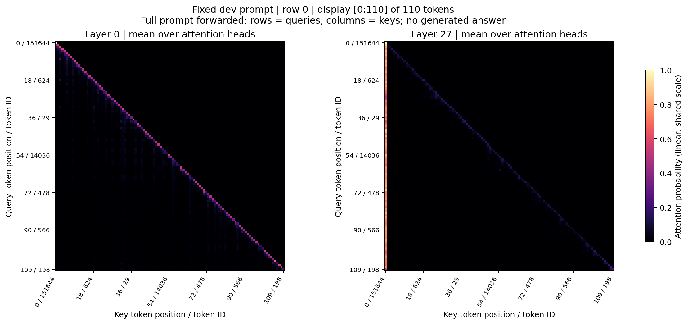

# 固定 dev 输入的注意力：训练前

本图使用原始 Qwen3-0.6B 基座，不加载 LoRA adapter。

固定输入来自准备后的 GSM8K dev 第 0 行（ID `gsm8k:train:466`）；它取自原始 train split 后划分出的 dev，文件 manifest 校验通过。模型实际接收完整 **110 token**，图中也展示全部 110 token；未生成回答。

图展示 **prefill 自注意力**：左侧是第 0 层，右侧是第 27 层（共 28 层，层号从 0 开始），每层对 **16 个 attention heads** 取算术平均。纵轴为 query 位置，横轴为 key 位置，刻度格式为“位置 / token ID”。两张图内部均共享线性色标；实际 NPZ 核验后，两次运行的显示范围均为 **0–1**。上三角对应尚不可见的未来 token。

原始 [NPZ](attention_head_mean.npz) 保存全部 28 层、完整 110×110 的**头平均矩阵**，不是每个独立 head 的全部原始张量。[层统计](layer_statistics.json) 在每个 head/query 行上针对 BF16 微小行和漂移归一化后计算；其中的 attention entropy 是输入位置分布熵，不是 GRPO 记录的词表预测熵。头平均会掩盖个别 head 的差异。

这是一道固定输入上的定性诊断：**不能作为模型推理正确性、学习机制或因果解释的证明，也不能替代主实验验收。** 图上的变化不代表某个被关注 token 对最终答案具有已验证的因果作用。

两个目录的 `tokens.json` 完全逐字节一致；input IDs SHA256 为 `921d071a89f54cce91b4bc3f5be14eab45633770f5f0d80d1f41661c009a0742`，tokens 文件 SHA256 为 `ddd77c18a30690c686f1cc105425dd0ed4f20139ddf913e7b42ba5cf53d5a34f`。训练后运行明确使用训练前 tokens 文件作为 `--reference-input` 并通过检查。

基座为 **Qwen/Qwen3-0.6B**，revision `c1899de289a04d12100db370d81485cdf75e47ca`；实际本地文件集合 SHA256 为 `6831766a64188ad08a449eb1e84dd5095163cc58e2e24b32fedf2f8dffa8ed5c`，加载前逐文件验证。更多来源、权重文件 SHA256 和图像摘要见 [manifest](manifest.json)，输入见 [tokens](tokens.json)。

执行为原生 Transformers eager、BF16、明确 `device=cpu`。CUDA 被屏蔽，OMP/MKL/OpenBLAS 线程上限均为 2，进程 affinity 限制为 2 个 CPU。没有 GPU forward；[execution.json](execution.json) 保留完整 CLI、环境限制、耗时和退出证据。

[同一逻辑图的 SVG 导出](attention_first_last.svg) 与 PNG 使用同一次绘图。

训练前 CPU forward 与产物生成耗时 8.73 秒；峰值子进程 RSS 约 1.55 GiB。[训练后对应图与说明](../attention-after/README.md)。

[独立视觉检查摘要与图像哈希](visual_qa.json)：PASS；完整本地审计过程保留于忽略的 `qa/` 目录。
