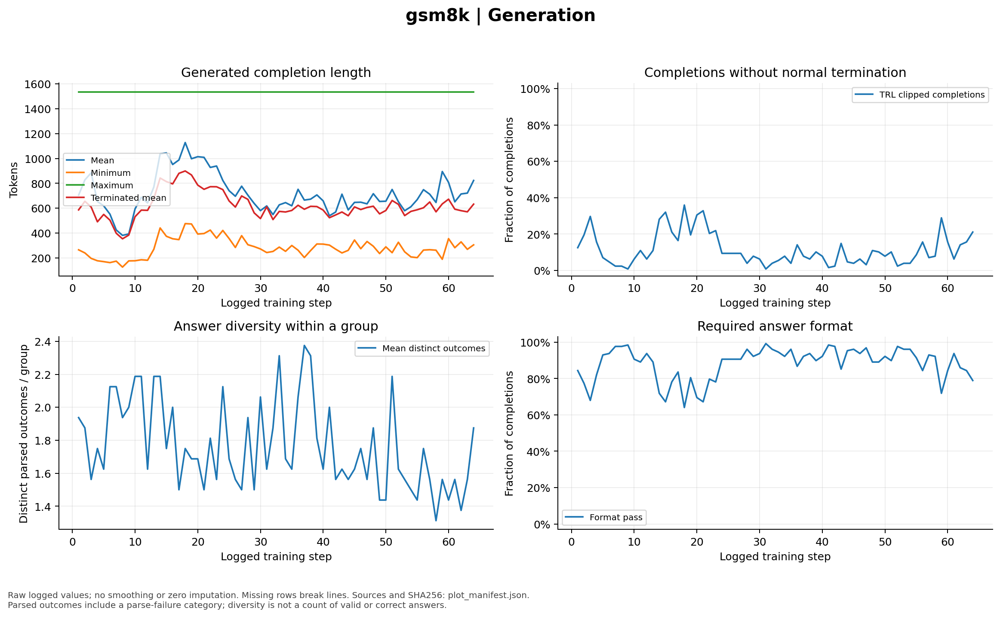

# GSM8K: 64-step GRPO training and audit results

These are measured diagnostics for `gsm8k-grpo-formal-001` using Qwen/Qwen3-0.6B, G=8 and B=16. The same fixed 128-item development set scored 92/128 (71.875%) at step 0 and 107/128 (83.59375%) at step 64. Development accuracy selected checkpoint 64. The complete 1,319-question audit and all mathematical-project acceptance gates have now passed. This figure set establishes the mathematical project.

## Learning

Training verifier reward, fixed development accuracy, optimizer loss, gradient norm, learning rate and nonzero advantages. Development evaluation occurred at steps 0, 16, 32, 48 and 64; connecting lines do not represent additional evaluations.

<!-- visual-inspection: role=independent_author_figure -->

## Stability

Temperature-scaled full-vocabulary predictive token entropy in nats, reference KL, policy clipping, zero-variance groups, advantage magnitude and reward variation. All-wrong and all-correct groups are shown separately. Zero clip fraction is expected for fresh single-update GRPO rollouts and does not establish small parameter updates. Falling predictive entropy alone does not prove collapse; this is not attention entropy.

<!-- visual-inspection: role=independent_author_figure -->

## Generation

Completion length, normal termination, distinct parsed outcomes within groups and required-format pass rate. Parse failure is included as a distinct outcome; diversity is not a count of valid solutions. TRL's terminated-length mean may be a zero fallback when no response terminates.

<!-- visual-inspection: role=independent_author_figure -->

## Trainer resources

PyTorch allocated, reserved and peak memory in GiB, generation-plus-scoring/reference throughput, and callback wall time including development evaluation. Allocator memory is not total device memory. Missing callback utilization or power metrics remain marked not recorded; measured system samples appear separately below.

<!-- visual-inspection: role=independent_author_figure -->

## System resources

Actual wall-clock samples of GPU utilization, total device memory in MiB, board power, GPU temperature and the monitored process's RSS. The time axis is seconds since the first resource sample, without optimizer-step interpolation. Cumulative board energy uses trapezoidal integration of sampled power; it excludes host CPU, includes board base power, and sampling can miss spikes. RSS covers the monitored PID rather than all child processes.

<!-- visual-inspection: role=independent_author_figure -->

Raw source paths, hashes, series definitions and PNG/SVG hashes are recorded in `plot_manifest.json`. Each SVG is an alternative vector encoding of the same corresponding PNG figure; it is not a separate logical figure placement.

## Held-out audit accuracy and project acceptance

The same 1,319 locked audit questions scored 837/1,319 (63.457%) before training and 970/1,319 (73.541%) after training with the selected step-64 adapter. The absolute gain is 10.083 percentage points; its paired bootstrap 95% interval is [7.657, 12.509] percentage points. The adjusted exact McNemar p-value is 6.874e-16. All eight recorded mathematical-project gates, including training integrity and GPU release, are true in `../acceptance.json`.

The left panel shows separate Wilson 95% intervals for each accuracy. The right panel shows the paired bootstrap interval for their difference. Statistical acceptance and overall mathematical-project acceptance are recorded separately; neither establishes completion of the two-domain objective.

<!-- visual-inspection: role=independent_author_figure -->

## Held-out generation length

On those same 1,319 audit questions, `avg_decode_tokens` is 797.293 before training and 738.180 after training, computed as the mean exact `response_tokens` including EOS. Responses truncated without EOS fell from 278/1,319 (21.077%) to 177/1,319 (13.419%). The cumulative distribution uses every recorded response, including incorrect and truncated outputs.

Shorter average output alone is not a latency claim: the recorded evaluation wall time was 2,254.64 seconds before and 2,353.29 seconds after. These are the actual before/after GRPO audit measurements; no completed four-arm strategy curve or multi-seed robustness result is claimed.

<!-- visual-inspection: role=independent_author_figure -->

